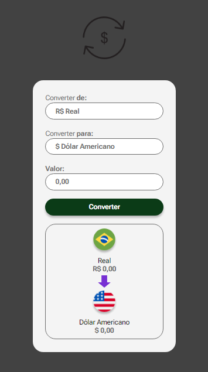

<h1 align="center">Conversor de Moedas v1.0 💰</h1>

 Projeto desenvolvido junto a formação <a target="_blank" href="https://rodolfomori.com.br/devclub/">DevClub</a>.

## 🚀 Tecnologias

Projeto desenvolvido com as seguintes tecnologias:

  
   
  

## 💻 Projeto

Neste desafio pude desenvolver minha lógica, quebrando a cabeça para utilizar API como fonte de dados da taxa de câmbio de cada moeda.   
Moedas convertendo entre si:

- R$ Real 💲
- £ Libra 💷
- $ Dólar americano 💵
- € Euro 💶
- ฿ Bitcoin ₿

## 🌐 Deploy

<a target="\_blank" href="https://italosantos8012.github.io/ProjetoConversorMoedas/"><b>Acesse e dê seu feedback!</b></a>

## 🌎 <i>Onde me encontrar:</i>  

   

